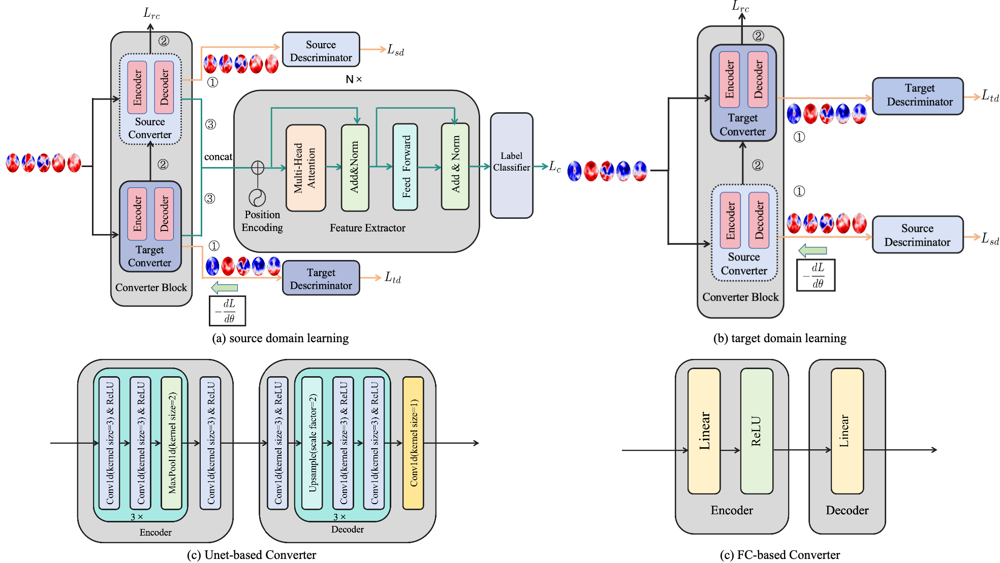

# DDCT (ICASSP 25)
This is the official implementation of our ICASSP 2025 paper "Double Domain Converter Transformer For Improving EEG-Based Emotion Recognition from Video to Game Scenarios".



## Abstract
Emotion recognition (ER) plays an important role in the field of modern technology and human-computer interaction. Traditional emotion recognition approaches usually utilize videos as stimuli. However, watching video lacks interaction. Recently, more and more game-related stimuli have been used. To explore emotion recognition in a more natural state, this study pioneers the use of Genshin Impact game and gameplay-related videos to evoke positive and neutral emotions. As 
Electroencephalogram (EEG) feature distributions of video and game scenarios are very different, we propose the Double Domain Converter Transformer network (DDCT) to enhance EEG-based cross-scenario emotion recognition, making full use of information from different domains. Our model has two converters that can convert input data into the source domain and the target domain, diminishing distribution difference in two feature spaces. Experimental results demonstrate that our model achieves a remarkable prediction accuracy of 84.95\% in video-game mix-scenario emotion recognition and 74.76\% in video to game cross-scenario emotion recognition.

## Requirements
* python==3.8.10
* pytorch==2.4.0

## Example
Example code for the use of MoGE:
```python
import torch
from torch import nn
from DDCT import DDCT

eeg = torch.randn(32, 5, 62)
model = DDCT(num_class=2, num_domain=2, num_layers=2, num_heads=2, dim_feedforward=512, convert_type='mlp',
             device=torch.device("cpu"))
class_out, source_rebuilt, target_rebuilt, source_out, target_out = model(eeg, 0)
print(class_out.shape)  # (32,2)
print(source_rebuilt.shape)  # (32,5,64)
print(target_rebuilt.shape)  # (32,5,64)
print(source_out.shape)  # (32,2)
print(target_out.shape)  # (32,2)
```
## Citation
If you find our paper/code useful, please consider citing our work:
```
@inproceedings{pan2025double,
  title={Double Domain Converter Transformer For Improving EEG-Based Emotion Recognition from Video to Game Scenarios},
  author={Pan, Jun-Yu and Yin, Hao-Long and Zheng, Wei-Long},
  booktitle={ICASSP 2025-2025 IEEE International Conference on Acoustics, Speech and Signal Processing (ICASSP)},
  year={2025},
  organization={IEEE}
}
```
